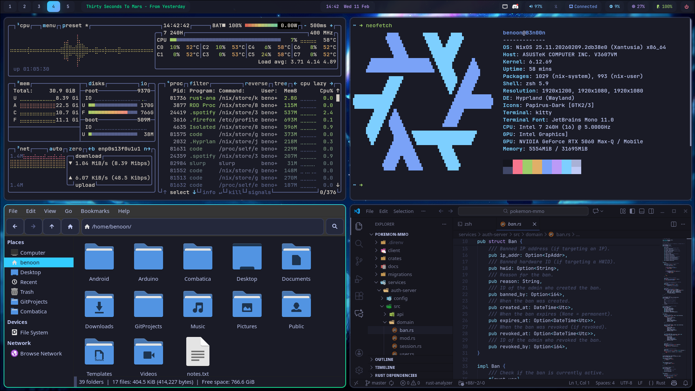
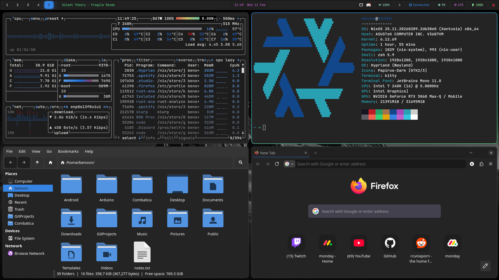
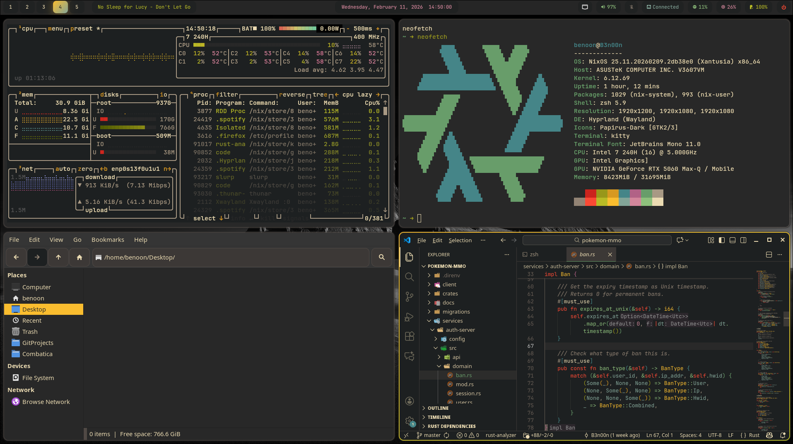

# nix-config

My NixOS + Hyprland setup. Fully declarative, themed across every component, managed with flakes.


## What's in here

| Component | Choice |
|---|---|
| OS | NixOS 25.11 (Flakes) |
| Window Manager | Hyprland |
| Terminal | Kitty |
| Shell | Zsh + Oh-My-Zsh |
| Editor | VSC, Neovim (LSP, Treesitter, Telescope) |
| Bar | Waybar |
| Launcher | Wofi |
| Browser | Firefox (custom CSS) |
| Notifications | Mako |
| Lock Screen | Hyprlock |
| File Manager | Thunar |
| Audio | PipeWire |
| GPU | NVIDIA (open-source, Wayland) |

## Themes

The entire system pulls colors from a single theme palette — Hyprland borders, Waybar, Kitty, Neovim, Firefox UI, GTK apps, Wofi, notifications, lock screen, even Spotify. Change one value and everything follows.

Four palettes included:

| Theme | Accent | Vibe |
|---|---|---|
| **Tokyo Night** | Cyan | Cool and dark |
| **Adwaita Dark** | Blue | Clean GNOME-inspired |
| **Adwaita Light** | Blue | Light mode done right |
| **Gruvbox Dark** | Gold | Warm and retro |

Themes are continuously being added.

Switching themes is a keybind away — `Alt+Shift+T` opens a picker, selects the palette, rebuilds the system, and restarts services automatically.

### Tokyo Night


### Adwaita Dark


### Gruvbox Dark


## Structure

```
.
├── flake.nix                   # Entry point
├── configuration.nix           # System-level imports
├── modules/
│   ├── variables.nix           # Single source of truth
│   ├── boot.nix
│   ├── networking.nix
│   ├── wayland.nix             # Hyprland + greetd + NVIDIA env
│   ├── nvidia.nix
│   ├── audio.nix               # PipeWire
│   ├── packages.nix
│   ├── programs.nix            # Zsh config
│   ├── services.nix            # Docker, Bluetooth, USB
│   ├── fonts.nix
│   ├── users.nix
│   ├── locale.nix
│   ├── nix-settings.nix
│   └── theme/
│       ├── default.nix         # Theme resolver + shared defaults
│       ├── lib.nix             # Color utilities (hex→rgba, etc.)
│       └── palettes/
│           ├── tokyo-night.nix
│           ├── adwaita-dark.nix
│           ├── adwaita-light.nix
│           └── gruvbox-dark.nix
├── home/
│   ├── home.nix                # Home-manager entry
│   ├── scripts/
│   │   ├── theme-switcher.sh
│   │   ├── screenshot.sh
│   │   └── power-menu.sh
│   └── programs/
│       ├── hyprland.nix
│       ├── kitty.nix
│       ├── neovim.nix
│       ├── waybar.nix
│       ├── wofi.nix
│       ├── firefox.nix         # Custom userChrome/userContent
│       ├── hyprlock.nix
│       ├── hypridle.nix
│       ├── hyprpaper.nix
│       ├── mako.nix
│       ├── gtk.nix             # GTK 2/3/4 theming
│       └── vscode.nix
└── assets/
    └── wallpapers/
```

## How theming works

All configuration values live in `modules/variables.nix`. The active theme name points to a palette file in `modules/theme/palettes/`. At build time, `flake.nix` resolves the palette and passes it as `theme` to every home-manager module through `extraSpecialArgs`.

Each palette defines:
- **Colors** — background, foreground, primary accent, surface levels, semantic colors
- **Terminal colors** — Full 16-color palette
- **App configs** — Neovim colorscheme, Spicetify theme, VS Code theme
- **Wallpaper** — Per-theme wallpaper path

Color utility functions (`hexToRgba`, `hexToRgb`, `removeHash`) handle conversion for CSS generation in Waybar, GTK, and Firefox configs.

```
variables.nix (theme.name = "tokyo-night")
       │
       ▼
flake.nix resolves palette ──► theme object
       │
       ├── hyprland.nix    (border colors, gaps)
       ├── waybar.nix      (bar styling, module colors)
       ├── kitty.nix       (terminal colors)
       ├── neovim.nix      (colorscheme, statusline)
       ├── firefox.nix     (userChrome CSS)
       ├── gtk.nix         (GTK 2/3/4 CSS)
       ├── wofi.nix        (launcher styling)
       ├── mako.nix        (notification colors)
       ├── hyprlock.nix    (lock screen styling)
       └── hyprpaper.nix   (wallpaper)
```

## Keybinds

| Key | Action |
|---|---|
| `Alt + Return` | Terminal |
| `Alt + Q` | Kill window |
| `Alt + B` | Firefox |
| `Alt + D` | Discord |
| `Alt + V` | VS Code |
| `Alt + S` | Spotify |
| `Alt + \` | App launcher |
| `Alt + F` | File manager |
| `Alt + L` | Lock screen |
| `Alt + W` | Fullscreen |
| `Alt + ENTER` | Float toggle |
| `Alt + Shift+S` | Screenshot |
| `Alt + Shift+T` | Theme switcher |
| `Alt + C` | Clipboard history |
| `Alt + 1-0` | Workspaces |
| `Alt + Shift+1-0` | Move to workspace |
| `Alt + Arrows` | Focus direction |

## Monitor setup

Triple-monitor layout with a docking station:

```
┌──────────┐ ┌──────────┐ ┌──────────┐
│ External2 │ │ External1 │ │  Laptop   │
│  DP-4     │ │  DP-3     │ │  eDP-1    │
│ 1080@165  │ │ 1080@165  │ │           │
└──────────┘ └──────────┘ └──────────┘
              (primary)
```

## Usage

Clone and rebuild:

```bash
git clone https://github.com/B3n00n/nix-config.git /etc/nixos
sudo nixos-rebuild switch --flake /etc/nixos
```