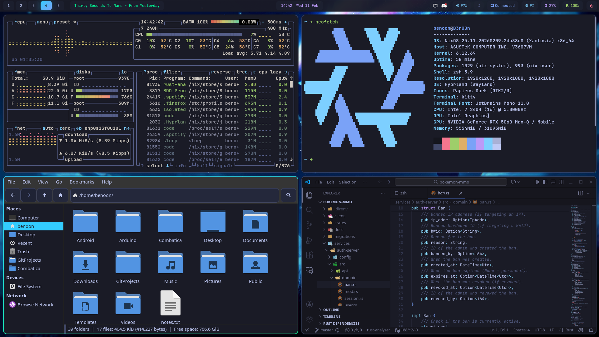

# nix-config

My NixOS + Hyprland setup. Flake-based, themed end-to-end from a single palette file.


## Stack

| Component      | Choice                                  |
|----------------|-----------------------------------------|
| OS             | NixOS 26.05 (flakes)                    |
| WM             | Hyprland                                |
| Bar / launcher | Waybar / Wofi                           |
| Terminal       | Kitty                                   |
| Shell          | Zsh + Oh-My-Zsh                         |
| Editor         | Neovim (LSP, Treesitter, Telescope), VS Code |
| Browser        | Firefox (themed via userChrome)         |
| Lock / idle    | Hyprlock + hypridle                     |
| Notifications  | Mako                                    |
| File manager   | Thunar                                  |
| Audio          | PipeWire                                |
| GPU            | NVIDIA (open kernel module, Wayland)    |

## Theming

One palette drives every themed surface: Hyprland borders, Waybar, Kitty,
Neovim, Firefox chrome, GTK 3/4, Qt, Wofi, Mako, Hyprlock, Spotify (Spicetify),
VS Code, and the wallpaper. Change `theme.name` in `modules/variables.nix` and
the whole system follows.

Two palettes ship: **Dracula** (purple) and **Tokyo Night** (cyan). Add a new
one by dropping a file in `modules/theme/palettes/` and an entry in
`modules/theme/integrations.nix`. Both files are schema-validated at eval —
missing fields fail the build.

`Alt+Shift+T` opens a Wofi picker that rewrites `variables.nix`, stages it
(the flake reads from the git index), and rebuilds.



## Layout

```
flake.nix                       # inputs + nixosSystem
configuration.nix               # system imports
hardware-configuration.nix
modules/
├── variables.nix               # typed, single source of truth
├── theme/
│   ├── default.nix             # HM module — exposes `config.theme`
│   ├── resolve.nix             # palette resolver
│   ├── types.nix               # palette + integration schemas
│   ├── lib.nix                 # hexToRgba, cssDefineColors, cssRootVars
│   ├── integrations.nix        # per-theme app config (vscode, neovim, …)
│   └── palettes/{dracula,tokyo-night}.nix
├── boot.nix  memory.nix  networking.nix  locale.nix
├── audio.nix  nvidia.nix  wayland.nix
├── users.nix  programs.nix  services.nix
├── packages.nix  fonts.nix
├── nix-settings.nix  nix-ld.nix
home/
├── home.nix                    # home-manager entry
├── xdg.nix                     # userDirs, mimeapps, .desktop for nvim
├── templates.nix               # Thunar "Create Document" templates
├── scripts.nix                 # wraps scripts/ with their runtime closures
├── scripts/{theme-switcher,screenshot,power-menu}.sh
└── programs/
    ├── hyprland/{default,bindings}.nix
    ├── waybar/{default.nix,style.css}
    ├── firefox/{default.nix,userChrome.css,userContent.css}
    ├── neovim/{default.nix,init.lua}
    ├── kitty.nix  mako.nix  wofi.nix  zathura.nix
    ├── hyprlock.nix  hypridle.nix  hyprpaper.nix
    ├── gtk.nix  vscode.nix  spicetify.nix
    ├── git.nix  zsh.nix  direnv.nix
assets/{wallpapers,theme-display}/
```

## Dev environments

Nothing project-specific is installed globally — no SDKs, no compilers, no
language servers beyond `nixd` for this repo. Each project carries its own
`flake.nix` devShell and an `.envrc` (`use flake`); direnv loads it on `cd`,
and the VS Code direnv extension picks the same environment up automatically.

VS Code extensions are the exception: they are part of the editor, so they stay
global in `vscode.nix` — including `dotnet-runtime_10`, which the C#/Dev Kit
extensions run their own code under. Without it they try to download a .NET
host, and a downloaded host cannot run on NixOS.

⚠️ In a non-git working tree, Nix copies the **entire directory** into the store
on every evaluation, since it only honours ignore files in git repos. For a
Unity project under Plastic SCM that means the 20+ GB `Library/` cache. Put the
flake in a `nix/` subdirectory and point `.envrc` at it with `use flake ./nix`.

## Keybinds (mod = Alt)

| Key                | Action                       |
|--------------------|------------------------------|
| `mod + Return`     | Terminal                     |
| `mod + Q`          | Kill window                  |
| `mod + B/D/V/S`    | Firefox / Discord / VS Code / Spotify |
| `mod + F`          | File manager                 |
| `mod + \`          | App launcher                 |
| `mod + L`          | Lock screen                  |
| `mod + W`          | Fullscreen                   |
| `mod + Space`      | Float toggle                 |
| `mod + T`          | Toggle split direction       |
| `mod + E` / `Shift + E` | Move to / toggle scratchpad |
| `mod + Shift + S`  | Screenshot (area)            |
| `mod + Shift + T`  | Theme switcher               |
| `mod + C`          | Clipboard history            |
| `mod + 1-0`        | Switch workspace             |
| `mod + Shift + 1-0`| Move window to workspace     |
| `mod + Arrows`     | Focus direction              |
| `mod + Ctrl + ←/→` | Move workspace to monitor    |
| `Win + Space`      | Cycle keyboard layout (us/il) |

## Monitors

Docked layout, set in `modules/variables.nix → hardware.monitors`:

```
┌──────────┐ ┌──────────┐ ┌──────────┐
│ external2│ │ external1│ │  laptop  │
│  DP-4    │ │  DP-3    │ │  eDP-1   │
│ 1080@165 │ │ 1080@165 │ │          │
└──────────┘ └──────────┘ └──────────┘
```

Run `hyprctl monitors` to find your output names if cloning this.

## Build

```sh
git clone https://github.com/B3n00n/nix-config.git /etc/nixos
sudo nixos-rebuild switch --flake /etc/nixos
```
